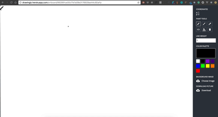

# Drawing

___

Web application for drawing the picture with your friends in real-time on one artboard by using Peer to Peer connection.

# Installation

1. `npm i`
2. `go install`

run dev server

1. `ng build --watch`
2. `go run main.go`
3. `docker-compose up`
3. open `localhost:3000`

# About project

On the front-end part of the application is using Angular 4 and [simple-peer](https://github.com/feross/simple-peer) node module for creating peer connection between browsers. On the back-end part is using Go for creating artboards, connection browsers to WebSocket channel and
send updated artboards to S3 storage.

For using Drawing open https://drawingjs.herokuapp.com. After that will be generated unique URL which you can share with your friends. When the other browser will be connected, you are able to see remote user cursor and everything that they draw.

Every changes on the artboard will available by unique URL which generated on the first session.

 
 
 

Code of mutileple peer to peer connection avaliable on this service [WorkSpaceP2PService](https://github.com/igorbezsmertnyi/drawing/blob/master/client/src/app/containers/work-space/work-space.peer-to-peer.service.ts)